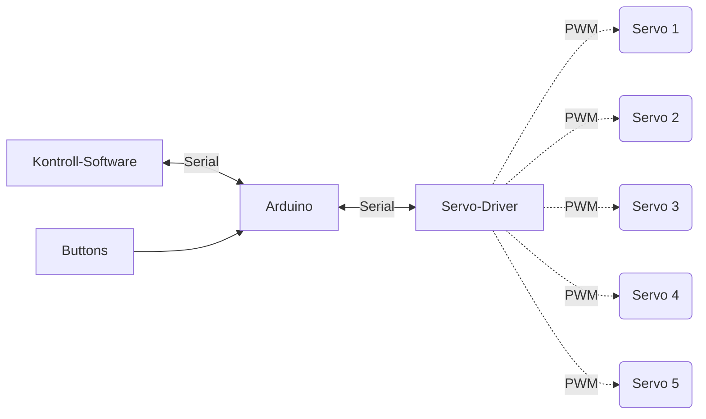

# System Architektur Überblick

## Hardware-Software Verbund

### Zusammenhang des Systems

### Erklärung

Die Kontrollsoftware sendet über eine serielle-Schnittstelle Datenpakete an den Arduino, welcher die einzelnen Servo-Motoren über einen externen Servo-Driver ansteuert. 

Der Arduino (und damit die Servos) kann theoretisch auch über Buttons welche direkt an den Arduino angeschlossen sind angesteuert werden. In diesem Fall gibt der Arduino lediglich die neuen Positions-Werte der Finger an die Kontroll-App zurück.
