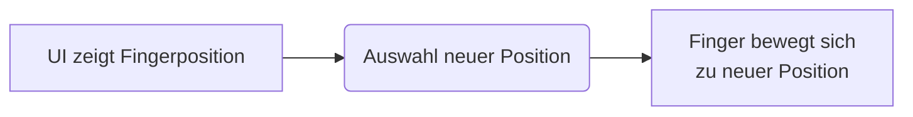
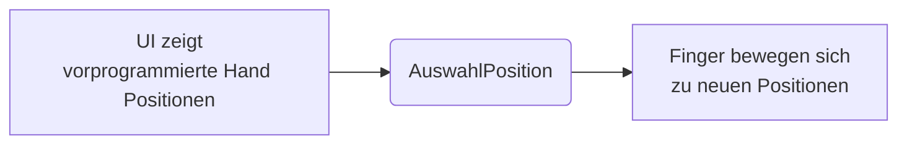
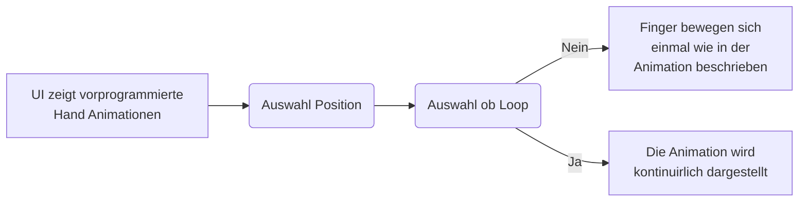
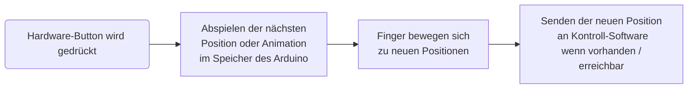
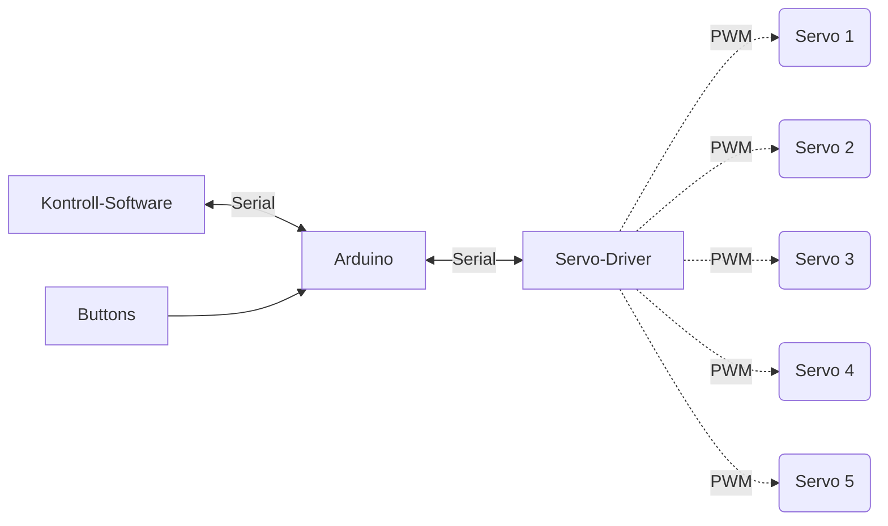
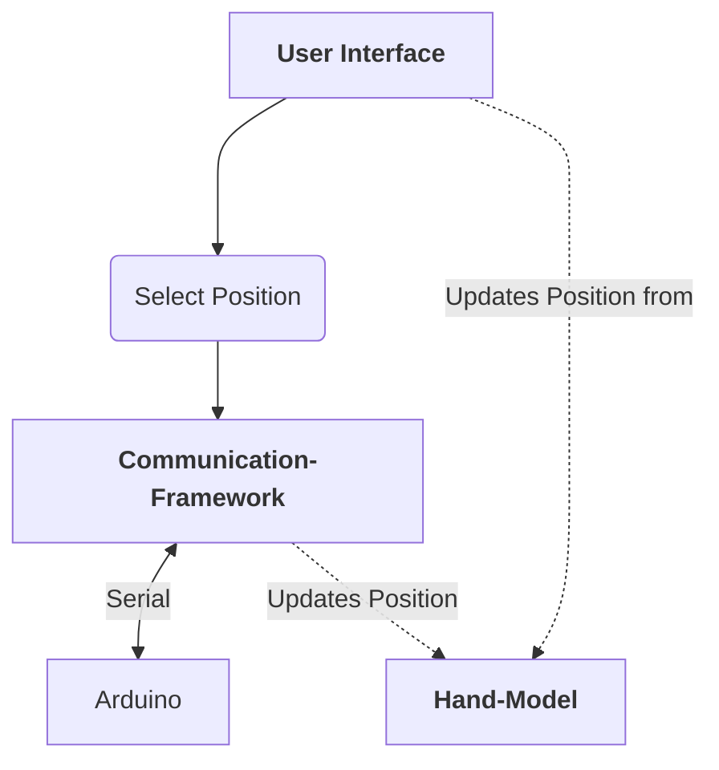

# Inhaltsangabe

[Toc]

# Einleitung

## Zweckbestimmung

Das Dokument dient als umfassende Zusammenfassung und Überblick über die Architektur der **3D-Bionics Bionic Hand**. Die Architektur wird aus mehreren Blickwinkeln (Views) betrachtet um die verschiedenen Funktionen zu beschreiben. Es soll die Grundlage für die Entwicklung darstellen und wichtige, Architektur-spezifische Entscheidungen verständlich erklären.

## Geltungsbereich / Scope

Von diesem Dokument aus wird die Architektur und Implementierung für die Software des **3D-Bionics Bionic Hand** gesteuert. Darunter fallen:

* Hardware-Software Verbund
  * Kommunikationsstandart
  * Kontrolle der Software über die Hardware
* Modul-Aufbau
* Klassendeklarationen
* Benutze Dependencies
* Oberflächen Design

## Definitionen und Abkürzungen

- **Hand, Handmodell:** Das Produkt für welches die Architektur geschrieben ist. Eine mechanische Hand, gesteuert über einen Arduino + Servomotoren.

  - **Im Kontext der Kontrollsoftware**, bezeichnet es die interne Software-Repräsentation der Hand

- **Arduino:** Ein in dem Handmodell verbauter Mikrocontroller. Steuert die Servomotoren.

- **Servomotor, Servo:** In dem Handmodell verbaute Servomotoren, welche für die Bewegungen in der Hand zuständig sind.

- **Finger**

  Als Finger wird das mechanische Bauteil an dem Hand-Modell bezeichnet, welches über den Arduino bzw. einen Servomotor bewegt wird. Die Finger sind gleichnamig den Bezeichnungen und Positionen an einer echten Hand nachempfunden. Sie werden können im folgenden Text wie folgt abgekürzt werden.

  - Kleiner Finger: `kF`
  - Ring Finger: `rF`
  - Mittel Finger: `mF`
  - Zeige Finger: `zF`
  - Daumen: `dF`

- **Animation:** Eine Animation beschreibt eine Abfolge von mehreren Positionen der Finger um eine bestimmten Bewegungsablauf der Hand darzustellen.

- **Kontroll-App:** Applikation über welche die Hand gesteuert werden kann

- **UI, Userinterface:** User-Interface der Kontroll-App

- **Communication-Framework, Comframe, COM: ** Framework, welches die Kommunikation der Positionen der einzelnen Finger zwischen der Kontroll-Software und dem Arduino regelt. Es legt die Grundstruktur und unterliegende Protokolle fest.


## Überblick

Das SAS ist in 5 Teile untergliedert:

Innerhalb von [**Ziele und Beschränkungen**](#Ziele und Beschränkungen) werden die einzelnen Funktionsanforderungen beschrieben und unter welchen Beschränkungen die Implementierung dieser geschehen muss.

Der [**Use-Case**](#Use-Case) View gibt einen Überblick über die tatsächliche Funktion des Programms anhand von verschiedenen Use-Cases. ==Diese sind grundgebend für den restlichen Ablauf des SAS. Ebenfalls werden die Module benannt welche für die jeweilige Funktion verantwortlich sind.==

Im [**System Architektur Überblick**](#System Architektur Überblick) wird ein grober Überblick über die Grundfunktionen und -Ideen sowie Aufbau des Projektes gegeben. Es wir sowohl die Hardware-Software-Beziehung beschrieben sowie der konzeptionelle Aufbau der Kontroll-Software

Der [**Logical View**](#Logical View) teilt dass Programm in Module auf und beschreibt dessen Funktionen und die Verbindungen zwischen den einzelnen Modulen welche auch als Grundlage für die Implementierung dienen. Des Weiteren werden auch die wichtigsten Klassen genauer beschrieben sowie die Verwendung der verschiedenen Libraries erläutert.

Der Punkt [**Implementierung**](#Implementierung) beschreibt die Grundstruktur des Programmcodes und die zugrundeliegenden Konventionen. Außerdem wird gezeigt, wie sich die Programmfunktionen in einzelne Programmcode-Module aufteilen.


# Ziele und Beschränkungen

Die Ziele und Beschränkungen sind innerhalb der System Requirement Spezification beschrieben.

# Use Cases

Der **Use-Case** View gibt einen Überblick über die tatsächliche Funktion des Programms anhand von verschiedenen Use-Cases. Diese sind grundgebend für den restlichen Ablauf des SAS. Ebenfalls werden die Module benannt welche für die jeweilige Funktion verantwortlich sind.

### Einzelne Ansteuerung eines Fingers über die Kontroll Software



### Ansteuerung der ganzen Hand über die Kontroll Software



### Ablauf einer Animation (mit Loop) über die Kontroll Software



### Festlegen einer vorprogrammierten Position oder Animation über Hardware-Button



# System Architektur Überblick

## Hardware-Software Verbund

### Zusammenhang des Systems



Die Kontrollsoftware sendet über eine serielle-Schnittstelle Datenpakete an den Arduino, welcher die einzelnen Servo-Motoren über einen externen Servo-Driver ansteuert. 

Der Arduino (und damit die Servos) kann theoretisch auch über Buttons welche direkt an den Arduino angeschlossen sind angesteuert werden. In diesem Fall gibt der Arduino lediglich die neuen Positions-Werte der Finger an die Kontroll-App zurück.

## Kontroll-Software

### Aufbau



Der Aufbau des Programms ähnelt des eines MVC-Paradigmas. Der Controller ist in diesem Fall das Communication-Framework. Es regelt die Kommunikation zwischen dem User-Interface und dem Arduino für die Hand Steuerung. Das Hand-Modell fungiert als Modell und repräsentiert die interne Position der Hand. Sie wird von dem Communication-Framework mit den Positionen des Arduino aktualisiert.


### Mögliches UI Design


# Logical View

## Dependencies

### PowerBroker2 / SerialTransfer

Library, welche für das tatsächliche transferieren von Informationen zwischen Arduino und Kontroll-Software verantwortlich ist. Sie dient als Backend für das [Communication-Framework](#Communication-Framework). 

Es gibt eine separate Library für den Arduino und in Python.

#### Links

- [PowerBroker2/SerialTransfer](https://github.com/PowerBroker2/SerialTransfer)
- [PowerBroker2/pySerialTransfer](https://github.com/PowerBroker2/pySerialTransfer)

### NPYScreen

> Npyscreen is a python widget library and application framework for  programming terminal or console applications. It is built on top of  ncurses, which is part of the standard library.
>
> [Quelle](https://npyscreen.readthedocs.io/introduction.html)

Zuständig für:

- Anzeigen und Erstellen des Terminal User Interfaces (==Füge Funktionale Anfoderung aus SRS ein==)
- Managen des Main-Update-Loops, welchem auch das Communication-Framework untergestellt ist


## Module

#### Übersicht

```mermaid

```


### Communication Framework

Das Communication-Framework oder auch COM ist dafür zuständig die Positionen der einzelnen Finger zwischen der Kontroll-Software und dem Arduino zu managen. Es regelt die Kommunikation über die serielle Schnittstelle und legt das Protokoll der Übertragung fest.

Das Modul Communication-Framework beschreibt das Framework konzeptionell und legt die Anforderungen fest. Die eigentliche Implementierung des Frameworks ist in den Modulen [Arduino-Com](#Arduino-COM) und [Kontroll-COM](#Kontroll-COM) individuell realisiert.

### Hand-Modell

Das Modul **Hand-Modell** beschreibt die interne Repräsentation der Hand für die Kontroll-Software. Es dient außerdem als Basis für das gesendete Format des Hand-Modells für das Communication-Framework.

### Hardware

Das Modul **Hardware** beschreibt alle Funktionalitäten welche direkt mit der Hardware zu tun haben. Dazu zählt zum einen die Programmierung des Arduinos sowohl die dafür benötigten Klassen zur Kontrolle der Servos (Submodul [Servo-Controller](#Servo-Controller)) sowie die Kommunikation zur Kontroll-Software (Submodul [Arduino-Com](#Arduino-COM)) 

#### Servo-Controller

Das Submodul **Servo-Controller** beschreibt die gleichnamige Klasse *ServoControll* welche als Interface für die fünf Servos der Finger dient. Das Ziel ist es die Servos über ein Array wie es in dem Modul [Hand-Modell](#Hand-Modell) beschrieben ist direkt anzusteuern.

#### Arduino-COM

Das Submodul **Arduino-COM** ist die Implementierung des [Communication-Frameworks](#Communication-Framework) auf dem Arduino.

### Kontroll-Software

#### Terminal User Interface

Das Modul **Terminal User Interface** beschreibt jegliche Funktionalität die für das Userinterface für die Kontroll-Software nötig ist. Dazu gehören:

- Forms und Widgetklassen für NPYScreen
- Callback-Definitionen für Interaktion mit der Software
- Einbindung des Kontroll-COM in die Kontroll-Sofware

#### Kontroll-COM

Das Submodul **Kontroll-COM** ist die Implementierung des [Communication-Frameworks](#Communication-Framework) für die Kontroll-Software.

---

## Hand-Modell

Die Hand wird software-intern als die Position der fünf einzelnen Finger dargestellt.

Die Streckung der Finger wird als eine Prozent-Angabe repräsentiert wobei 0% für "Finger komplett entspannt" und 100% für "Finger komplett geschlossen" steht.

#### Eigenschaften

- **Format: ** `[Position kF, Position rF, ...]` 

- Die Reihenfolge innerhalb des Arrays ist **kF, rF, mF, zF, dF**


## Communication-Framework

> Das Communication-Framework oder auch COM ist dafür zuständig die Positionen der einzelnen Finger zwischen der Kontroll-Software und dem Arduino zu managen. Es regelt die Kommunikation über die serielle Schnittstelle und legt das Protokoll der Übertragung fest.
>
> Das Communication-Framework besteht aus zwei Teilen. Der Erste Teil befindet sich in der Kontroll-Software und der zweite im Arduino.

### Aufgaben nach SRS

- Positionen der einzelnen Finger über die Kontroll-Software an den Arduino weitergeben
- Komplexere Positionsabläufe über die Kontroll-Software an den Arduino weitergeben
- Das interne Hand-Modell mit Positions-Updates des Arduinos zu aktualisieren
- Automatisches Aufbauen einer Verbindung mit dem Arduino

### Kommunikations-Standard

#### Anfoderungen

- Die Kommunikation läuft über eine serielle Schnittstelle zwischen Kontroll-Software und Arduino.
- Es werden nur dann Positionen gesendet wenn sich auch etwas an der Position der Finger verändert hat, oder sich etwas ändern soll
- Gesendete Positionen sind stets im Format wie es in [Hand-Modell / Format](# Hand-Modell) beschrieben wird 
- Eine Animation ist eine Liste von hintereinander gesendeten Positionen
- Das Communication-Framework hat eine interne Message-Queue, welche asynchron abgearbeitet werden kann. 


#### Sequenz eines Positionsupdates

```mermaid
sequenceDiagram
	UI ->> Kontroll-COM: neues Positionsupdate
	Kontroll-COM ->> Kontroll-COM: update Queue
    Kontroll-COM ->> Arduino-COM: sendet Position
    alt Kontrol-Software Mode
    	Arduino-COM ->> Arduino: Servo Update 	
    else Button Mode
   		Button ->> Arduino:  Instruction [5V Signal]
    end
    
    Arduino ->> Arduino: Set internal System Queue
    Arduino ->> Arduino: Update Servos
    
    Arduino-COM ->> Kontroll-COM: sendet neue Position
    Kontroll-COM ->> UI: Update Position
 	
```

