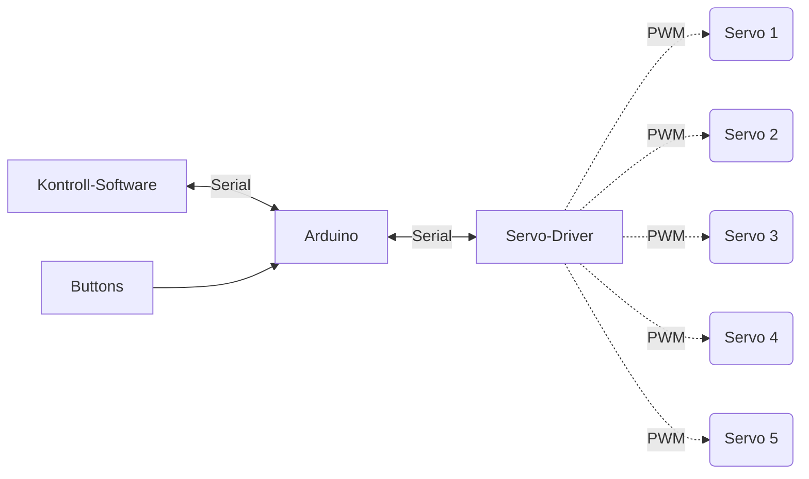
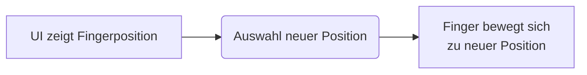
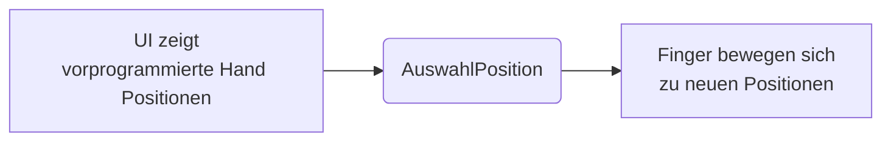
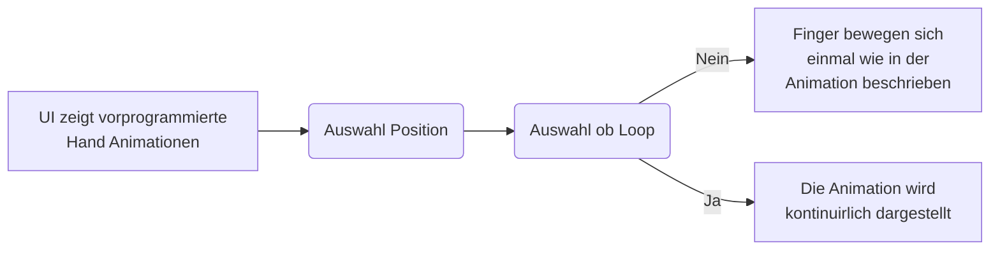
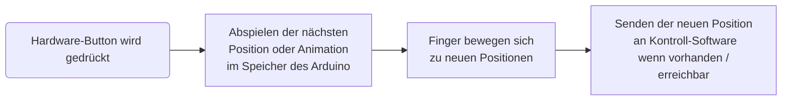

# System Architektur Überblick

## Hardware-Software Verbund

### Zusammenhang des Systems

### Erklärung

Die Kontrollsoftware sendet über eine serielle-Schnittstelle Datenpakete an den Arduino, welcher die einzelnen Servo-Motoren über einen externen Servo-Driver ansteuert. 

Der Arduino (und damit die Servos) kann theoretisch auch über Buttons welche direkt an den Arduino angeschlossen sind angesteuert werden. In diesem Fall gibt der Arduino lediglich die neuen Positions-Werte der Finger an die Kontroll-App zurück.

# Definitionen und Abkürzungen

- **Hand, Handmodell:** Das Produkt für welches die Architektur geschrieben ist. Eine mechanische Hand, gesteuert über einen Arduino + Servomotoren.
  - **Im Kontext der Kontrollsoftware**, bezeichnet es die interne Software-Repräsentation der Hand
- **Arduino:** Ein in dem Handmodell verbauter Mikrocontroller. Steuert die Servomotoren.
- **Servomotor, Servo:** In dem Handmodell verbaute Servomotoren, welche für die Bewegungen in der Hand zuständig sind.

- **Finger**

  Als Finger wird das mechanische Bauteil an dem Hand-Modell bezeichnet, welches über den Arduino bzw. einen Servomotor bewegt wird. Die Finger sind gleichnamig den Bezeichnungen und Positionen an einer echten Hand nachempfunden. Sie werden können im folgenden Text wie folgt abgekürzt werden.

  - Kleiner Finger: `kF`
  - Ring Finger: `rF`
  - Mittel Finger: `mF`
  - Zeige Finger: `zF`
  - Daumen: `dF`

- **Animation:** Eine Animation beschreibt eine Abfolge von mehreren Positionen der Finger um eine bestimmten Bewegungsablauf der Hand darzustellen.

- **Kontroll-App:** Applikation über welche die Hand gesteuert werden kann

- **UI:** User-Interface der Kontroll-App

- **Communication-Framework, Comframe, COM: ** Framework, welches die Kommunikation der Positionen der einzelnen Finger zwischen der Kontroll-Software und dem Arduino regelt. Es legt die Grundstruktur und unterliegende Protokolle fest.

# Use Cases

### Einzelne Ansteuerung eines Fingers über die Kontroll Software

### Ansteuerung der ganzen Hand über die Kontroll Software

### Ablauf einer Animation (mit Loop) über die Kontroll Software

### Festlegen einer vorprogrammierten Position oder Animation über Hardware-Button

